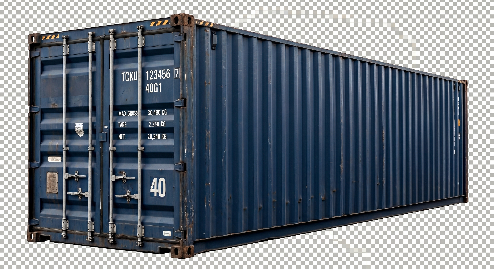
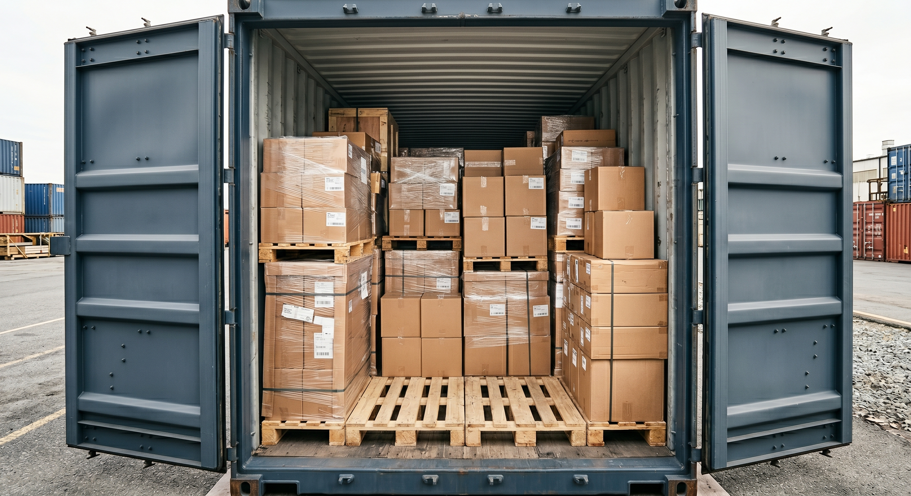

A shipping container is a great storage tool. It has steel walls and a strong lock. A Wind and Water Tight container also keeps out rain, wind, snow, and bugs. But keeping out rain is not the same as controlling heat and cold inside. That gap causes most storage mistakes. Here are 12 things that don't belong in a container.

## Why a Sealed Container Still Isn't Safe for Everything

A closed, sealed steel box gets hot like a car in a parking lot. In summer, it can heat up fast under the sun. In winter, it can get colder than the air outside. And overnight, the air inside can turn to water on the walls. It's like how a cold glass of lemonade sweats on a warm day. That's called condensation. It happens when warm, moist air touches cold metal. We explain [why a container "rains" inside, and how to stop it](/blog/why-does-my-container-rain-inside-condensation/), in its own guide.

None of this means the container is broken. It's just physics acting on a big piece of bare metal. Anything that can't handle heat, cold, or being shut away from fresh air will struggle. A few things are outright unsafe. The 12 items below are the worst offenders in each group.

*Watertight and secure outside doesn't mean climate-controlled inside.*

## Moisture-Sensitive Items

These items fail because of moisture in the air, not leaks. They can get ruined even in a container that never lets in a drop of rain.

### 1. Paper, books, and important documents
Paper soaks up moisture from the air. It can warp, get moldy, or grow mildew. This happens even if the container never leaks a drop. Photos and important papers are the most fragile. Once mold sets in, they are often ruined for good.

If you store paper, use sealed plastic totes. Add a desiccant packet inside each tote. A desiccant packet is a small bag that soaks up extra moisture. It's like the little packet inside a new pair of shoes. Skip cardboard boxes on the floor.

### 2. Cardboard boxes themselves
Cardboard soaks up moisture like a sponge. This happens even if the box is empty. Damp cardboard can grow mold. It also gets weak and collapses under stacked weight. Use stackable plastic totes instead, especially for long-term storage.

### 3. Cement, mortar, and other bagged dry mixes
Cement and mortar harden the moment they get damp. A little moisture turns a good bag into a solid, useless block. These dry mixes need a dry space with a steady temperature. A container isn't that space — it can "sweat" on the inside as seasons change.

### 4. Bare metal tools
Bare metal tools rust fast when moisture builds up inside a container. It happens faster than most people expect, even indoors. A light coat of rust-preventing oil helps a lot. Keep tools off the floor and up on a shelf, too.

## Temperature-Sensitive Items

These items fail because of temperature swings. A closed container can get oven-hot in summer. It can drop below freezing in winter. There's no thermostat inside a steel box.

### 5. Food that can spoil
In summer, the inside of a closed container gets much hotter than any pantry or fridge. In winter, it swings just as far the other way. Food that spoils doesn't belong in a container at any time of year.

### 6. Live plants
Plants need light, steady temperatures, and fresh air. A sealed steel box has none of these. Even a short stay can cook or freeze a plant, depending on the season.

### 7. Electronics that hate heat and moisture
Electronics face two threats in a container. Moisture can corrode their metal contacts and circuit boards. "Corrode" just means slowly eaten away, like rust on an old bike. Big heat and cold swings wear out their batteries and seals, too. If you must store electronics, seal them in insulated packaging first. Never leave them loose on a shelf.

## Hazardous and Flammable Materials

These items are not just a storage problem. They are a safety problem. The honest answer for all of them is: ask a professional. Don't try a DIY workaround.

### 8. Propane tanks and other flammable gases
A sealed container has no airflow. That makes it a bad place for anything that can leak, build pressure, or catch fire. Propane and other flammable gases need their own vented spot outdoors. Keep them away from buildings and anything that could make a spark. Not sure how to store propane or gasoline safely? Ask your local fire department or your fuel supplier first.

### 9. Batteries, especially lead-acid
Batteries can leak, give off fumes, or even catch fire if damaged. Heat makes all of these risks worse. If you store batteries in a container, keep them off the floor. Keep them at a steady temperature if you can. Keep them away from anything flammable. When in doubt, ask a battery store or your local hazardous-waste program.

### 10. Paint, solvents, and other chemicals
Paint and solvents have real fire and airflow rules. A solvent is a strong liquid that dissolves things, like paint thinner. A regular container doesn't meet those rules. "It's probably fine" is not a safe answer here. Talk to a professional or check your local fire code first.

### 11. Ammunition and firearms
Rules for storing ammunition and firearms change by state and city. A shipping container isn't built as secure storage for either one. This article can't give you a blanket yes or no. Follow your local and federal rules. Ask a professional if you're not sure what they are.

## Long-Term Problem Items

### 12. Rubber and tires, long-term
Rubber breaks down over time from sunlight and heat cycles. Tires stored for years in a hot container tend to dry out and crack. They wear out faster than tires kept in a cool, airy space. Short-term storage is fine. If you're storing tires for years, expect some wear no matter where they sit.

*Sealed totes up on shelves beat boxes on the floor for almost everything on this list.*

## What to Do Instead

Once you know the pattern, most fixes are easy:

- **Paper and documents:** Use sealed plastic totes, not cardboard. Add a desiccant packet to each tote.
- **Batteries:** Store them on a shelf, away from anything flammable. Check on them often instead of sealing them up and forgetting them.
- **Anything sensitive to moisture:** Keep it off the floor and off the walls. Keep it away from bare metal. A little open space around it helps a lot.

These tips don't replace good airflow or a desiccant setup for the whole container. If you see moisture problems beyond this list, that's usually a fixable airflow issue. It's not a reason to avoid container storage altogether.

## Where to Go Next

This list covers the hard "don'ts." Most other household and business items store just fine in a container. Just keep moisture and temperature swings in mind. Want the full rundown on what "Wind & Water Tight" does and doesn't cover? Visit our [condition guide](/condition/). For container sizes, markings, and specs, check the [container reference hub](/container-reference/).

---

Not sure what container size fits your stuff? Our [size guide](/size/) and our [complete container size chart](/blog/shipping-container-dimensions-size-chart/) walk through the options, or [get a real quote](/quote/) and we'll help you figure it out.
