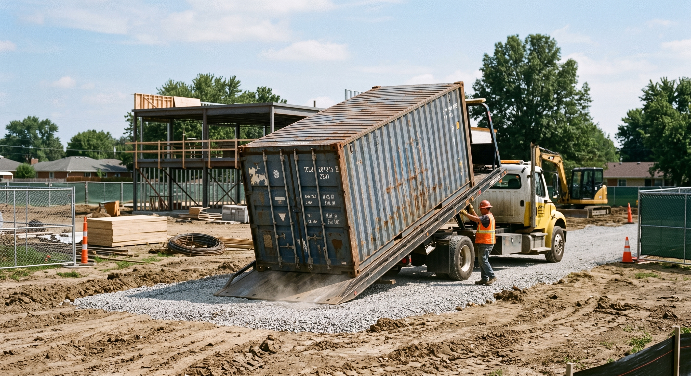
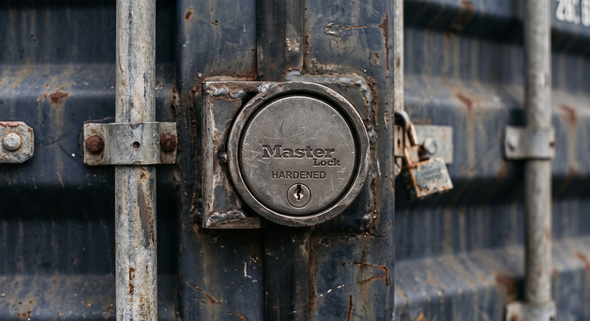

> **This is an illustrative scenario** — a common pattern we see across our Ohio, Indiana, and Kentucky service area. It is not an account of one real customer.

A remodeling contractor near Dayton kept losing tools out of his truck. Twice in one summer, someone broke in overnight and took his gear. He didn't buy cameras or an alarm. Instead, he moved his tools into a locked steel shipping container, parked right at the job. It's one of the simplest fixes we see. It shows why a locked box often beats a pile of extra security gear.

## The Truck Kept Getting Robbed

The contractor worked alone most days. He moved between two or three houses a week. His truck bed was his shop. Saws, drills, ladders, a compressor — it all rode in the truck. At night, it sat locked in a job-site garage or in the truck itself.

That worked fine, until it didn't. One morning, he found his truck's lock box popped open. Half his hand tools were gone. A few weeks later, it happened again at a different house. This time it was a cordless saw and a full case of drill bits.

Neither break-in was loud or messy. No broken glass. No alarm going off. Someone just walked up in the dark. They worked the lock for a minute. Then they left with an armful of gear.

*A tilt-bed truck sets the container right where the work is. No framing crew. No build time.*

## What It Was Really Costing Him

Buying new tools is the easy cost to see. The harder cost is the day you lose. Every theft meant a late start the next morning. It also meant an awkward call to the homeowner, explaining why the crew showed up late again.

Insurance helped some. It did not cover the deductible. It also did not help with the client who was starting to wonder if the crew could keep anything safe on their property. That's the part that stuck with him. Not the missing drill. The feeling that his jobsite wasn't under his control.

## Weighing the Options

He looked at three ways to fix it.

**Keep locking tools in the truck, but add more security.** A steering-wheel lock and a truck alarm helped a little. But someone with a few quiet minutes could still get in.

**Rent a storage unit across town.** A storage facility meant driving tools back and forth each day. It also meant working around the facility's own gate hours. That ate time he didn't have. It was also a bill that never stopped, as long as he kept renting.

**Buy a container and keep it on-site.** A Wind & Water Tight (WWT) used shipping container is a steel box with a strong, built-in locking door. No separate alarm needed. It's a one-time buy, not a monthly bill. And it moves with the job, instead of the job moving to it.

## The Locked Box on the Jobsite

He chose the container. It got delivered straight to the job. It sat in a spot the homeowner agreed to, out of the way of the work itself.

From there, every tool, cord, and box of screws had one home. Not three. At the end of the day, everything went into the box. The doors closed. The puck lock went on. No tailgate lock box. No half-empty truck bed. No gear split between the cab and a garage corner.

*A puck lock on solid steel doors is a harder target than the lock box on a typical truck.*

Before the container went in, he checked with the property owner and the local building office about any rules on placing it. That's the same step we tell every buyer to take. Permit and zoning rules depend on your city or county. It's always the buyer's call to check, not ours.

## The Lesson

Nothing fancy solved this. No camera system. No guard. No alarm company. Just one steel box with one good lock, sitting where the work was happening, instead of thirty minutes away.

If your crew keeps losing tools, the fix isn't always more security gear. Sometimes it's fewer places for things to go missing from in the first place.

## Facts in This Story

- Every container Steel Box Direct sells is **Wind & Water Tight (WWT)** — used, checked over, and sealed against rain, wind, and pests.
- Containers are a **one-time buy**, not a monthly rental. There are no ongoing fees to keep using one.
- We deliver and service within roughly **250 miles of Cincinnati** — Ohio, Indiana, Kentucky, and western West Virginia.
- **Almost all deliveries take about two weeks.** We give you an honest window before you commit.
- **Permit and zoning rules are always the buyer's job** to check locally before placement.

## If This Sounds Familiar

See how contractors near you use containers on real jobs on our [contractor use-case page](/for/contractors/). Check what "Wind & Water Tight" really means on our [condition page](/condition/). Or look at a [20-foot container](/shipping-containers-for-sale/20-foot-shipping-container/) sized for one crew's tools and materials.

Ready to see what it would take for your jobsite? [Get a real quote](/quote/) and tell us your size, zip code, and what you're storing.
