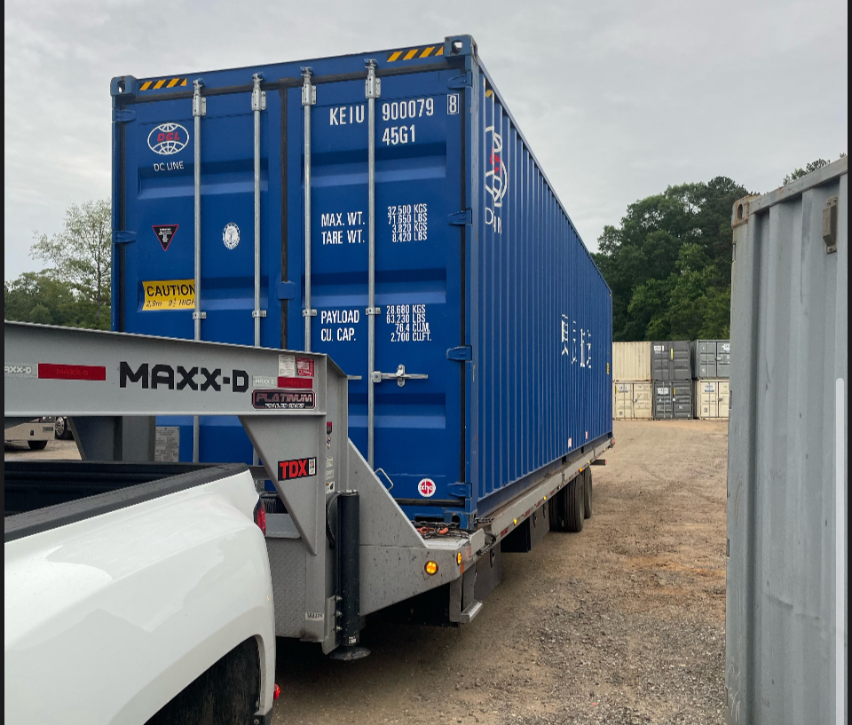

Every shipping container has two short codes painted on its doors and roof. One is an 11-character ID number. The other is a 4-character size/type code. Both follow **ISO 6346** — the worldwide rule book for container markings. The ID says whose fleet the box belongs to and which unit it is. The size/type code tells you its true size, no matter what a listing claims.

## The 11-character ID number, decoded

Read the ID left to right. It breaks into four parts:

| Part | Length | What it means |
|---|---|---|
| Owner code | 3 letters | The fleet's registered prefix. BIC (the Bureau International des Containers) keeps the official list at bic-code.org — think of it as the DMV for container name tags. |
| Equipment category | 1 letter | Almost always **U** for freight container. (J = detachable freight-container equipment, Z = trailer/chassis — you won't see those on a storage box.) |
| Serial number | 6 digits | This unit's own number, assigned by the owner. Two containers can share an owner code. They can never share a serial number. |
| Check digit | 1 digit, shown in a box | A number computed from the first 10 characters. If it doesn't match, the ID was mistyped, misread, or altered. |

The owner code plus the category letter is sometimes called the "owner prefix." That pair is what BIC actually registers. The serial number and check digit belong to the box itself.

## A real example, decoded top to bottom

Take a real-format container ID like **KEIU 900079-8**, with a size/type code of **45G1**. We'll walk it through part by part.

*Every standardized container carries its ID number and size/type code stenciled on the doors and roof.*

Breaking it down:

- **KEI** — owner code (the registered prefix for this container's fleet)
- **U** — equipment category (freight container)
- **900079** — serial number for this exact unit
- **8** — check digit (boxed on the door; we'll verify it below)
- **45G1** — size/type code (decoded in the next section)

## Why the check digit exists — and how to check it yourself

The check digit isn't decoration. It's a math trick that catches typos — like the last number on a credit card. A smudged stencil or a swapped digit gets caught before the box lands on the wrong ship or the wrong paperwork. ISO 6346 defines the math in its annex. You can run it by hand on any container.

**Step 1 — Turn each of the first 10 characters into a number.** Digits keep their face value. Letters use a fixed table. The table skips every multiple of 11 (11, 22, 33...) so no two letters can be confused: A=10, B=12, C=13, D=14, E=15, F=16, G=17, H=18, I=19, J=20, K=21, L=23, M=24, N=25, O=26, P=27, Q=28, R=29, S=30, T=31, U=32, V=34, W=35, X=36, Y=37, Z=38.

**Step 2 — Multiply each value by a doubling weight.** The weights run 1, 2, 4, 8... up to 512, left to right (2⁰ through 2⁹). Add up all the products.

**Step 3 — Divide the sum by 11.** The remainder is the check digit. One exception: if the remainder is 10, the check digit is 0.

Running it on **KEIU900079**:

| Character | Value | × Weight | = Product |
|---|---|---|---|
| K | 21 | × 1 | 21 |
| E | 15 | × 2 | 30 |
| I | 19 | × 4 | 76 |
| U | 32 | × 8 | 256 |
| 9 | 9 | × 16 | 144 |
| 0 | 0 | × 32 | 0 |
| 0 | 0 | × 64 | 0 |
| 0 | 0 | × 128 | 0 |
| 7 | 7 | × 256 | 1,792 |
| 9 | 9 | × 512 | 4,608 |

Sum = 6,927. Divide by 11: that's 629 with a remainder of **8**. It matches the boxed digit on the door. The ID checks out.

You'll never need to do this math in the field. The point is simpler: a container's ID is a self-checking code. It's not just a number somebody wrote down.

## The 4-character size & type code

Right under the ID, every container carries a 4-character code — **45G1** in our example. It describes the box itself, no matter what a listing or seller says.

- **1st character — length:** `4` = 40ft. (2 = 20ft, L = 45ft.)
- **2nd character — height:** `5` = 9'6" tall — a "high cube," one foot taller than standard. (2 = 8'6" standard, 0 = 8'0".)
- **3rd–4th characters — type:** `G1` = a general-purpose dry box with small passive vents that let it breathe. (G0 = no vents; U codes = open-top; P codes = flat rack.)

So **45G1** reads as: a 40ft, 9'6"-tall, general-purpose dry container with vents. That's a real, checkable claim about the box — not marketing copy.

### Why this code matters more than it looks

Anyone can type "40ft high cube" into a listing. The code on the door is the container reporting its own size, under a standard no seller gets to redefine. Comparing a used container against a size chart? Cross-check the code against [the full container dimensions table](/container-reference/#dimensions). Our [complete shipping container size chart](/blog/shipping-container-dimensions-size-chart/) also lays out the exact inside and outside measurements for every size, so you can match a size/type code to real numbers. Don't take a description at face value. Steel Box Direct sells three sizes, all Wind & Water Tight (used): 20ft Standard, 40ft Standard, and 40ft High Cube. The size/type code is the fastest way to confirm which one you're looking at.

*Two containers can look nearly identical from a distance — the size/type code is what actually distinguishes a 40ft Standard from a 40ft High Cube.*

## How this connects to the CSC plate

The ID number and size/type code are painted on. A few feet away, usually near the door hinge, there's also a riveted metal plate: the **CSC plate**. Think of it as the container's safety report card. It's required under the IMO's International Convention for Safe Containers. It records the box's maximum gross weight, its stacking limit, its racking test load (a side-to-side frame-strength test), and its last structural exam date.

The two markings do different jobs. The ID number says *which* container this is. The CSC plate says *what it's rated to do*. Some CSC plates repeat the size/type code — a second place to cross-check it. We cover [how to read the CSC plate and markings](/container-reference/#markings) in more detail on our reference hub.

## Using the ID number when buying a used container

Before you commit to a used container, check the markings. It takes five minutes and costs nothing:

1. **Find the ID on the doors and roof.** Legitimate units carry it in both places.
2. **Run the check digit** — or at least confirm all four parts are legible and agree with each other.
3. **Read the size/type code.** Compare it to the box's real, measured footprint — not just the seller's description.
4. **Cross-check the CSC plate** if one is present and legible.

None of this replaces a real inspection. A valid ID tells you the container's identity adds up. It says nothing about rust, floor condition, or door alignment. For that, pair this check with a proper walkthrough. Our [container buying guide](/container-buying-guide/) covers the full inspection list, and our [condition guide](/condition/) explains exactly what "Wind & Water Tight" does and doesn't mean.

---

Ready to see what a Wind & Water Tight container looks like up close? [Get a real quote](/quote/) and we'll walk you through exactly what you're buying.
