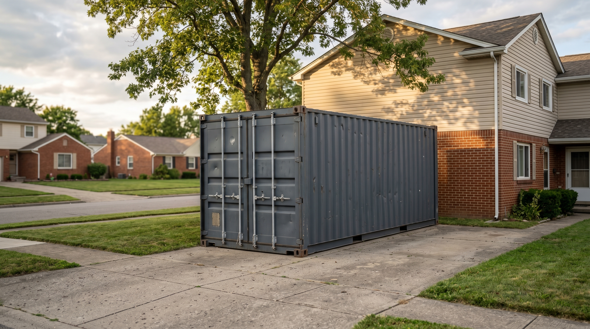
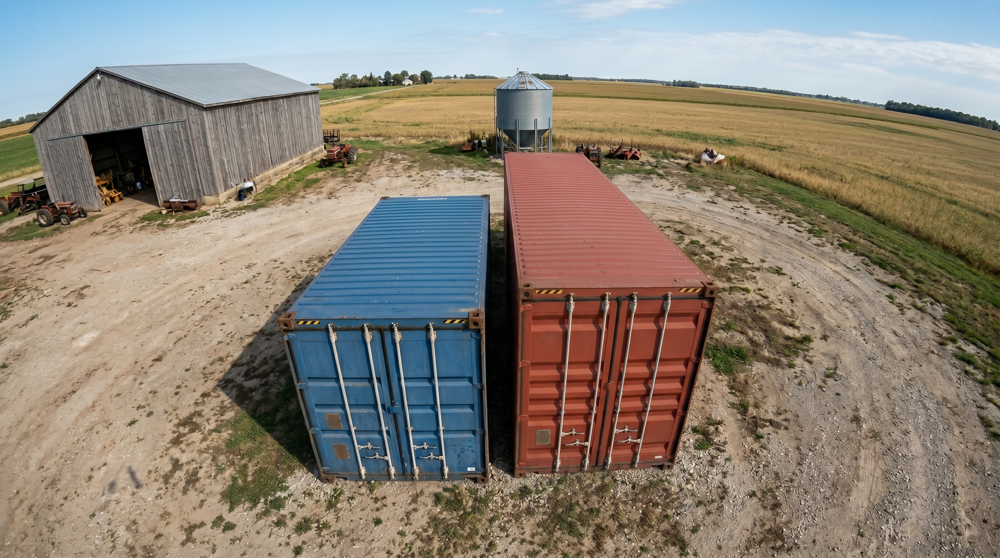

> **Sample / placeholder post.** This article exists to verify the blog template renders correctly. It is not published content and is excluded from the sitemap and production build while `draft: true`.

Picking a container size comes down to one question: what are you actually putting inside it?

## Start with what you're storing

Before comparing footprints, make a rough list of what needs to fit — equipment, seasonal inventory, tools, or household overflow. A container that's too small gets crowded fast; one that's too large wastes yard space and delivery clearance.

## The three sizes most people compare

- **20ft standard** — a tight, efficient footprint. Good for a single piece of equipment, seasonal gear, or a compact workshop.
- **40ft standard** — roughly double the floor space of a 20ft, useful when you're storing more volume without needing extra height.
- **40ft high cube** — the same footprint as a 40ft standard with about a foot more interior height, which matters if you're stacking pallets or running shelving.

*(FPO — placeholder image. A 20ft standard is the tightest of the three footprints — good for a single piece of equipment or seasonal overflow.)*

## A simple gut check

Walk your intended contents (or a rough mockup) and measure the space it occupies. Add a margin for walking room and access to items in the back. If you're between two sizes, sizing up usually costs less in regret than sizing down.

*(FPO — placeholder image. Seeing two sizes side by side on the same lot is the fastest way to gut-check your pick.)*

Every container we sell is Wind & Water Tight (used) — structurally sound and sealed against the weather, regardless of which size you land on.

Have questions about how a specific size fits your project? [Get a real quote](/quote/) and tell us what you're storing — we'll help you land on the right footprint.
