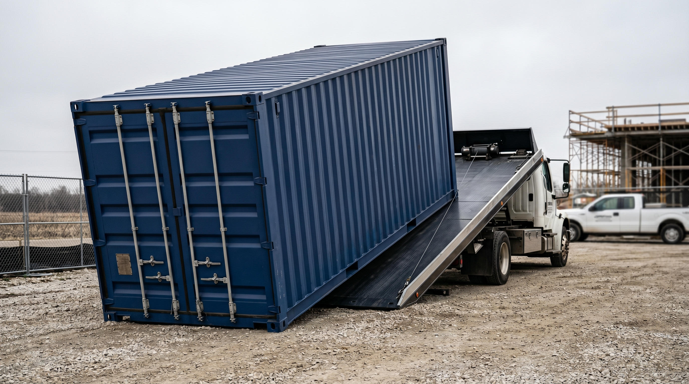
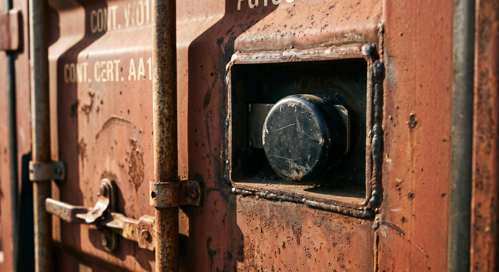

> **Sample / placeholder post.** This article exists to verify the blog template renders correctly. It is not published content and is excluded from the sitemap and production build while `draft: true`.

When you need secure on-site storage, a pole barn and a shipping container solve overlapping problems in very different ways.

## Setup time

A pole barn is a construction project — site prep, a foundation or footings, framing, and a roof. A used shipping container is a delivered unit: it arrives on a truck and is set in place the same day, weather permitting.

*(FPO — placeholder image. A tilt-bed delivery sets the container in place the same day — no framing crew, no multi-week build.)*

## Security

Steel walls and a factory-built locking door system give a container a security profile that's hard to match without added hardware. A pole barn's security depends entirely on the doors, windows, and locks you install.

*(FPO — placeholder image. A puck-lock hasp on steel doors is a harder target than the hardware on a typical pole barn entry.)*

## Weather resistance

Every container we sell is Wind & Water Tight (used) — sealed against rain, wind, snow, and pests out of the gate. A pole barn's weather-tightness depends on the quality of its build and ongoing maintenance of the roof and siding.

## Permanence and permitting

A pole barn is built in place: posts set in concrete, framing raised on site, and a roof put up over it. A container arrives finished and sits on the ground it is set on, so it can be picked up and moved again if your needs change. How each one gets treated under local rules is a separate question from how it is built, and that answer comes from your local jurisdiction. Either way, **permit and zoning requirements are always the buyer's or builder's responsibility to confirm with their local jurisdiction** before placement, and requirements vary widely by county and property type.

## Which one fits your project?

If you need storage fast, want minimal site work, and value steel security, a container is usually the simpler path. If you need a large open workspace with vehicle access on multiple sides, a pole barn may be worth the longer build timeline.

Curious what a container-based setup could look like for your site? [Get a real quote](/quote/) and tell us about your project.
