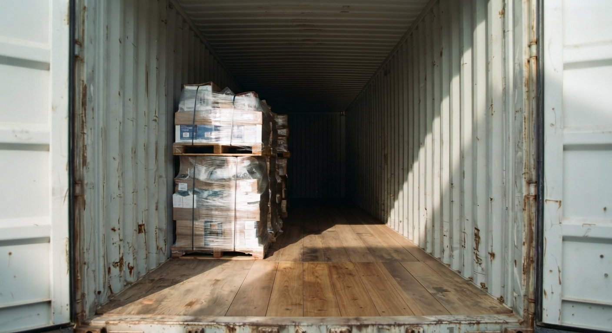
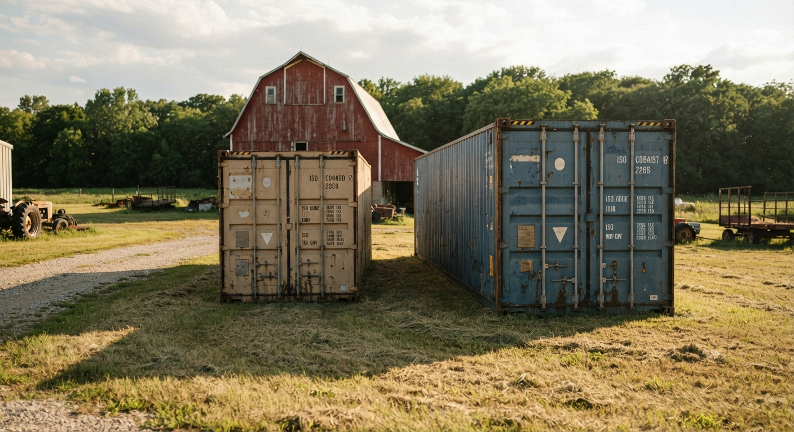

Shipping containers come in six standard sizes. They run from 10ft to 45ft. A rule book called ISO 668 sets the sizes. The three most common are 20ft, 40ft, and the taller 40ft High Cube. Steel Box Direct sells all three, Wind & Water Tight (used). This chart gives the exact size for each one.

## The full size chart (10ft-45ft)

Here is every standard size. You'll see the outside measurements, the inside measurements, the door opening, and how much space each one holds. These figures come from ISO 668:2020. That's the standard that sets container sizes worldwide.

| Size | Outside (L × W × H) | Inside (L × W × H) | Door opening (W × H) | Holds |
|---|---|---|---|---|
| 10ft Standard | 9'9.75" × 8'0" × 8'6" | 9'3" × 7'8.5" × 7'10.1" | 7'8.1" × 7'5.8" | 561 cu ft |
| **20ft Standard** ✓ | 19'10.5" × 8'0" × 8'6" | 19'4.2" × 7'8.5" × 7'10.1" | 7'8.1" × 7'5.8" | 1,172 cu ft |
| 20ft High Cube | 19'10.5" × 8'0" × 9'6" | 19'4.2" × 7'8.5" × 8'10.1" | 7'8.1" × 8'5.8" | 1,320 cu ft |
| **40ft Standard** ✓ | 40'0" × 8'0" × 8'6" | 39'5.7" × 7'8.5" × 7'10.1" | 7'8.1" × 7'5.8" | 2,387 cu ft |
| **40ft High Cube** ✓ | 40'0" × 8'0" × 9'6" | 39'5.7" × 7'8.5" × 8'10.1" | 7'8.1" × 8'5.8" | 2,691 cu ft |
| 45ft High Cube | 45'0" × 8'0" × 9'6" | 44'5.7" × 7'8.5" × 8'10.1" | 7'8.1" × 8'5.8" | 3,037 cu ft |

The ✓ marks the three sizes Steel Box Direct sells. Each is Wind & Water Tight (used). The other three are shown for reference only. [See why, below](#which-sizes-does-steel-box-direct-actually-sell).

## Why "inside" is always a little smaller

A "20-foot container" is 20 feet long on the outside. But step inside, and it measures closer to 19 feet 4 inches.

That's not a mistake. The steel walls, floor, and corner posts all take up a little room. Every size loses a few inches this way. So when you plan what will fit, use the *inside* numbers. Don't use the name.

The width stays close to 7'8.5" inside on every standard size. Length and height are what change from one size to the next.

Not sure which size a used container really is? The 4-character size/type code stenciled on its door settles it. Here's [how to read a container's ID and size/type code](/blog/how-to-read-container-id-number-iso-6346/), like the 45G1 that marks a 40ft High Cube.

## Square feet and cubic feet, explained simply

Two numbers matter most when you picture what fits. They are floor space (square feet) and total room (cubic feet).

- **Floor space** is length times width. It's the ground you have to walk on and stack boxes across.
- **Cubic feet** adds in height. It's the *total* room, including anything you stack up high.

Using the inside measurements above, the floor space works out to roughly:

- 10ft: about 70 sq ft
- 20ft (Standard or High Cube): about 150 sq ft
- 40ft (Standard or High Cube): about 305 sq ft
- 45ft High Cube: about 345 sq ft

### Why High Cube matters for stacking

A High Cube container has the same footprint as its standard twin. A footprint is just the ground the box covers, like the outline of a rug. But a High Cube stands about a foot taller inside, roughly 8'10" instead of 7'10". The floor space doesn't change. The extra headroom does.

That extra foot matters most for pallets stacked two-high, hung shelving, or tall equipment. It's also why the 40ft High Cube is easier to find used than the plain 40ft standard.

*Pallets stacked two-high with room to spare above. The High Cube's extra foot of interior height is what makes the second layer fit.*

## What fits in each size

Numbers on a chart are one thing. Here's a plainer way to picture each size.

- **10ft**: about the size of a single-car garage stall, but not as tall. Fits a small vehicle or a modest amount of gear, with little room to spare. Rare used.
- **20ft**: about the length of two parking spaces, end to end. Fits one tractor and its attachments, a motorcycle collection, seasonal gear, or a compact workshop.
- **40ft**: about twice the length of a 20ft, roughly four parking spaces. Fits a full equipment lineup, several vehicles, or a season's worth of business inventory.
- **40ft High Cube**: the same footprint as a 40ft standard, with a foot more headroom. Good for stacked pallets, tall shelving, or equipment with height, like a combine.
- **20ft High Cube and 45ft High Cube**: reference sizes, not commonly found used. The 45ft is the largest standard size. Moving one usually calls for an oversize permit and a special trailer. Checking on permits is the buyer's job, with the local permitting office.

*A 20ft and a 40ft side by side on the same farm. Seeing the two lengths together is often the fastest way to judge which one fits your plan.*

Want a size picked around your own list of items? Our [size guide](/size/) walks through the decision step by step.

## Which sizes does Steel Box Direct actually sell?

Of the six standard sizes, Steel Box Direct sells three, all Wind & Water Tight (used):

- [20ft Standard](/shipping-containers-for-sale/20-foot-shipping-container/)
- [40ft Standard](/shipping-containers-for-sale/40-foot-shipping-container/)
- [40ft High Cube](/shipping-containers-for-sale/40-foot-high-cube-container/)

These three make up almost all of the used market in our region. The other three sizes are 10ft, 20ft High Cube, and 45ft High Cube. Those are mostly built new, or used just once for a single ocean trip. They rarely show up used, so we don't stock them. They're included above so this chart is a complete reference, not because they're something we offer.

Every container we sell is checked and sealed against rain, wind, snow, and pests before it reaches you. Our [condition guide](/condition/) explains exactly what that Wind & Water Tight standard covers, and our [plain-English guide to what "Wind & Water Tight" means](/blog/wind-and-water-tight-explained/) breaks the grade down term by term.

## Use the interactive size calculator

Charts are useful, but a quick back-and-forth is often faster. Answer a few questions about what you're storing. Our [size calculator](/size/calculator/) will point you to the size that fits.

You can also cross-check these figures against the compact dimensions table at [Container Reference](/container-reference/#dimensions). It pulls from the same ISO 668:2020 source as this chart.

---

Ready to see one of these sizes in person? [Get a real quote](/quote/) and tell us what you're storing, and we'll help you land on the right footprint.
