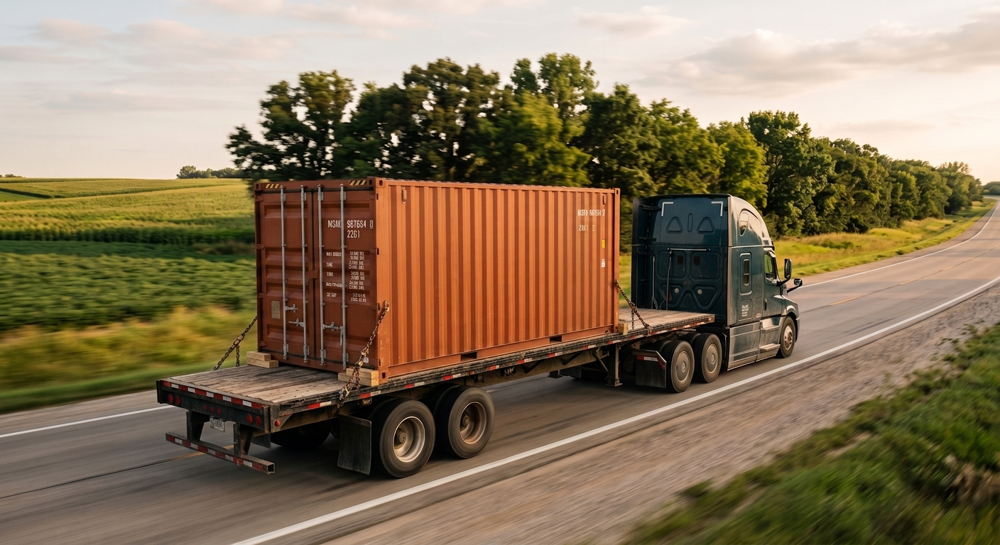

> **This is an illustrative scenario**, a common pattern we see across our Ohio, Indiana, and Kentucky service area. It is not an account of one real customer.

A buyer called us one afternoon, sure he had a great deal. Someone could sell him a container for "eight or nine hundred dollars." Our salesperson asked one short question. The line went quiet. Then the buyer said, slowly, "No…" That quiet moment is the whole story. It's the oldest trap in container buying, and one small question springs it loose.

## The Deal That Sounded Too Good

The buyer had done some looking. He found a price that beat everything else by a wide margin. Eight or nine hundred dollars for a steel container felt like a steal.

He wasn't being careless. He was being smart with his money. A low number jumps out at you. That's what it's built to do.

So he called us, mostly to check his own math. He wanted to know if we could match it. He was proud of the find, and it's easy to see why.

## The One Question

Our salesperson didn't argue the price. He just asked one thing:

**"Did that include shipping?"**

The line went quiet. You could almost hear the gears turning. Then, slow and a little deflated, came the answer: "No…"

That was the moment the deal changed shape. The eight or nine hundred dollars wasn't the price of a container *at his house*. It was the price of a box sitting in a yard, somewhere else. Getting it to his property was a whole separate cost. And on a container, that cost is not small.

## Why Delivery Costs Real Money

Here's the part a low sticker price hides. A shipping container is big and heavy. You can't toss it on a regular trailer. You can't set it down by hand.

It takes a special truck, usually a tilt-bed or a crane. It takes a trained driver who knows how to place it. It takes fuel and time. And the farther that box has to travel to reach you, the more that trip costs.

None of that is a trick. It's just real work by real people. Moving a heavy steel box the right way costs money, no matter who does it. So when a price leaves delivery out, it isn't the true price. It's only half of it.

## The Trap Isn't the Price. It's the Missing Piece.

The cheap container wasn't a lie. The box might have been real and fine. The problem was what the price left out.

A low number that skips delivery makes you feel like you found a deal. Then the freight quote shows up later, and the "steal" isn't a steal anymore. Sometimes it costs more than a higher price that included delivery from the start.

That's why the sticker price alone can fool you. Two sellers can list very different numbers and end up costing the same, or flip completely, once the box is actually in your yard.

## Compare Delivered Totals, Not Stickers

There's a simple way to protect yourself. Don't compare sticker prices. Compare **delivered totals**.

Ask every seller the same thing: *What's the one price to get this container to my address, set on the ground?* One number. Container plus delivery to your ZIP. That's the only fair match-up.

A price that looks higher up front can be the cheaper deal once you add it all up. The only way to know is to compare the same thing, side by side: delivered-to-you against delivered-to-you.

This is why Steel Box Direct quotes **all-in**. The number we give you already includes the container, delivery to your ZIP code, and setting it on flat ground. The number you're told is the number you pay. Nothing waiting to surprise you later.

## The Lesson

The buyer didn't get burned that day. One question saved him, before he'd handed over a dime.

If you're shopping for a container, that question is yours to keep: **"Does that price include delivery?"** A cheap sticker price almost never does. Ask it early, ask it every time, and you'll compare the real cost instead of a number built to catch your eye.

## Facts in This Story

- **Delivery is a real, separate cost.** Moving a heavy steel container takes a special truck and a trained driver, so a low sticker price often leaves it out.
- **Always ask: "Does that price include delivery?"** It's the fastest way to tell a real price from a teaser.
- **Steel Box Direct quotes all-in:** container, delivery to your ZIP, and placement on flat ground, so the number you're quoted is the number you pay.
- **Compare delivered totals, not sticker prices.** A higher sticker with delivery included can cost less than a cheap one once freight is added.
- **Every container Steel Box Direct sells is Wind & Water Tight (WWT):** one used grade, sealed against rain, wind, and pests.

## If This Sounds Familiar

Learn what really goes into a container's price on our [cost page](/cost/). See the containers we sell, all quoted delivered, on our [shipping containers for sale page](/shipping-containers-for-sale/).

Ready for your real, all-in number? [Get a quote](/quote/) and tell us your size, ZIP code, and where the box is going. One price, delivered to you.
