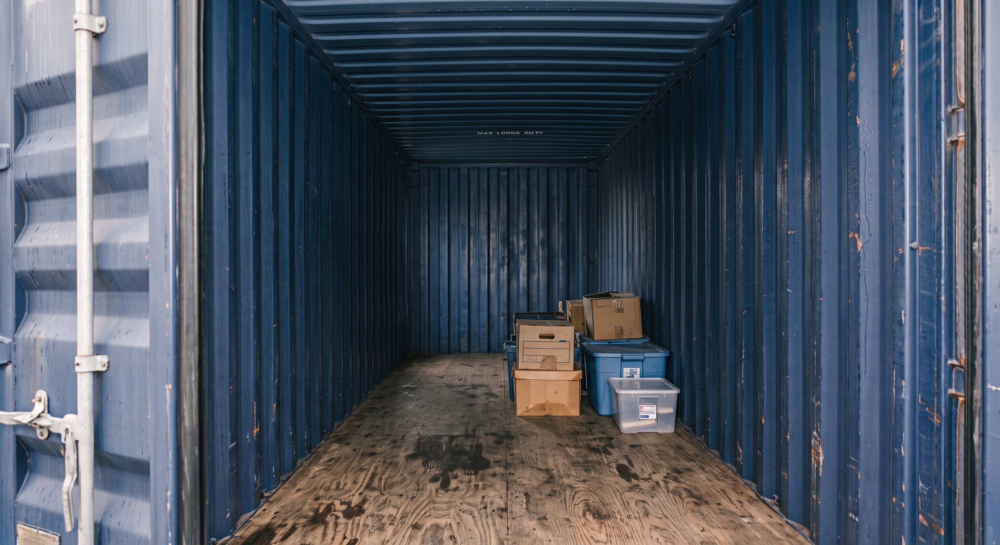
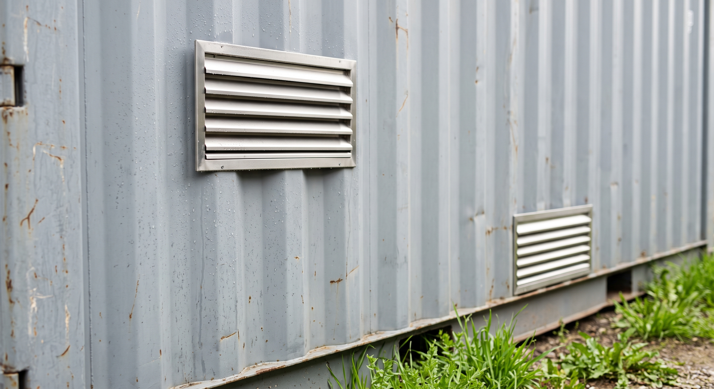

You open your container on a cold morning. The ceiling is dripping. Everything under it looks soaked, like it sat through a storm. But the doors were shut. The roof seals were fine. It hasn't rained in a week.

This is condensation, not a leak. Warm, wet air gets trapped inside your steel box. That air touches the cold inside walls. It cools fast. The water in the air has nowhere left to go. So it turns into drops on the ceiling and walls. Then it falls like rain.

This happens most in fall and early spring. That's when day and night are far apart in heat. The fixes are simple: vents, desiccants (small packs that soak up water), and sometimes a fan.

## The heat and water, in plain words

Air always carries some water. You can't see it, but it's there. Warm air can hold more water than cold air. That's the whole trick behind this.

Think of air like a sponge. A warm sponge can hold a lot of water. A cold sponge can't hold as much. Wet air touches your container's cold steel. The air cools fast, just like a warm sponge turning cold. Now it can't hold all its water. So the extra water squeezes out, right onto the steel.

That cold point has a name: the "dew point." It's just the spot where air has to let its water go. Past that point, the water comes out somewhere. No leak. No broken seal. Just plain science, doing what it always does inside a closed metal box.

You've seen this before. A cold glass of water sweats on a hot day. Your bathroom mirror fogs up after a hot shower. A shipping container does the same thing. It's just much bigger. Steel heats up fast and cools down fast too. So on a cold night, the ceiling and top walls can get very cold. They can drop below the dew point, even while the floor stays warmer.

*Condensation shows up first on the steel overhead (the ceiling and upper wall panels) before it reaches anything stored below.*

## Why it's worse in fall and early spring

Condensation follows the seasons. It hits hardest when day and night are far apart in heat. In most of our area, that's **fall and early spring**. It's not the deep summer or deep winter.

Here's why. During the day, warm, wet air gets trapped inside your container. At night, it gets cold fast. The steel cools below the dew point. It cools before the trapped water can get out. So the water turns into drops.

Summer nights stay warm. There's less of a swing. Winter air holds less water to begin with. Fall and spring bring both problems at once: trapped water and a big drop in heat. That's why those weeks are the worst.

Does your container "rain" for a few weeks each spring and fall, then stop? That's normal. It's not a sign that anything changed with the container.

## "Wind & Water Tight" doesn't mean climate-controlled

This mix-up trips up a lot of first-time buyers. So let's be clear about it.

**Wind & Water Tight (WWT)** means a container keeps out rain, wind, snow, and bugs. [See our condition guide](/condition/) for the full grade, or read [what "Wind & Water Tight" actually means](/blog/wind-and-water-tight-explained/) for the plain-English breakdown of the sealing that WWT covers. WWT says nothing about the air already inside a closed box. No steel container, new or used, controls its own indoor air on its own.

Controlling the air inside is a whole different job. It takes insulation, plus heat, cooling, or a dehumidifier (a machine that pulls water out of the air). That's called climate control. It's not part of what "sealed" or "weather-tight" means, for any container, from us or anyone else.

So if your WWT container is "raining" inside, nothing is broken. It's not a sign the seal failed. It's just what any sealed, bare steel box does when the outside air changes. A brand-new container would do the exact same thing.

## The fix ladder: easiest to hardest

None of these steps stop condensation for good, in every climate. No container can promise that, insulated or not. But used in order, each step cuts down how much water forms and drips.

### 1. Passive vents

The easiest fix lets trapped, wet air trade places with drier outside air. Vents go high and low in the walls. They create airflow. That airflow carries the wet air out before it can turn to drops overnight. This is usually the first thing worth adding. It needs no power. It needs almost no upkeep.

*Passive vents, placed high and low, let wet air trade places with outside air, with no power needed.*

### 2. Desiccants

Desiccants are small packs or buckets that soak up water right out of the air. They catch the water before it ever reaches the steel. Calcium chloride buckets and silica gel bags are common kinds. They cost little. They need no wiring. They work well in a small container. They also work well for one area, like a stack of boxes, instead of the whole space. You do need to check them and swap them out now and then. Moisture-sensitive things like paper, cardboard, and bare-metal tools need this protection most. They're near the top of our list of [things you should never store in a shipping container](/blog/12-things-never-store-in-a-shipping-container/) without it.

### 3. Powered or humidistat-controlled vents

Sometimes plain vents aren't enough. Maybe your container stays sealed most of the time. Maybe your climate is humid all year. A powered fan vent does more work than plain vents alone. Pair it with a humidistat. That's a sensor that turns the fan on only when the air gets too wet. It runs only when it's needed.

Here's a real safety note: **have a licensed electrician wire any power into a steel container.** Skip the DIY extension-cord setup. The small extra step is worth doing it the safe way.

### 4. Insulation

This is the biggest job. But it fixes the real cause, instead of just covering it up. Insulating the walls and ceiling keeps the steel closer to the heat of the air inside. That means the steel is less likely to ever drop below the dew point.

This usually makes the most sense for a workshop, office, or any container people use often. For plain storage, vents and desiccants alone usually do the job.

## When a dehumidifier stops helping

A portable dehumidifier can be a good add in humid places. It works best paired with vents. But it has a real limit worth knowing up front.

Most dehumidifiers pull less water out of the air as it gets cold. Many barely work at all once it's well below room heat. So a dehumidifier that works great in your container in July might do very little in a January cold snap. And that's exactly when condensation tends to be worst. Don't count on a dehumidifier alone in cold weather. Pair it with plain vents. Those keep working no matter how cold it gets.

## A simple way to think about it

Condensation is about water and heat. It's not about container quality. Every sealed steel box will show some "rain" inside under the right conditions. New or used, it makes no difference. It doesn't care what grade the container is.

The fixes above deal with that. They aren't fixing a defect, because there isn't one.

Do you see water coming in from a seam, corner, or the roof, right after rain? That's a different issue worth a look. Check our [container reference](/container-reference/) page for markings and inspection notes. But drops on the ceiling on a clear, cold morning are exactly what they look like: warm air meeting cold steel.

---

Buying a used container and want the full picture on what "sealed and sound" really covers? [See our condition guide](/condition/), or [get a real quote](/quote/) and we'll walk you through what you're buying.
