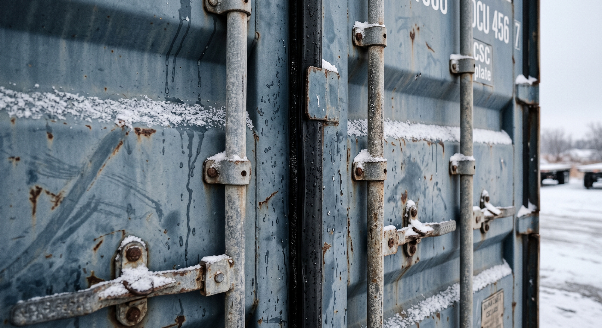
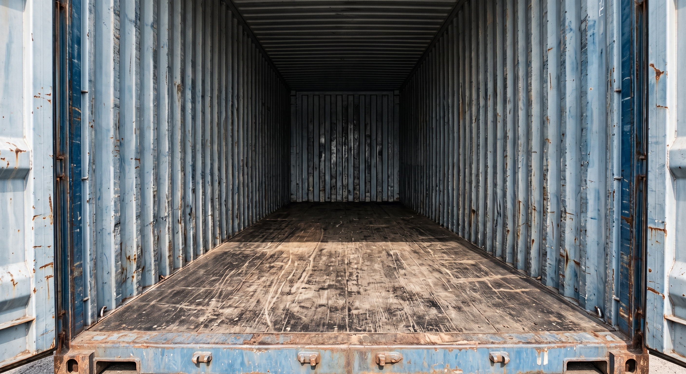

**"Wind & Water Tight" (WWT) means a used shipping container still keeps out rain, wind, snow, and pests, and its steel frame is still strong.** It's retired from hauling cargo at sea, not worn out. WWT is not a certified ocean-shipping grade, and it's not climate control. It's the honest, working-condition steel that Steel Box Direct sells: one grade, sealed and sound.

You've probably seen "WWT" on a listing and wondered what it promises. This guide breaks it down in plain words. You'll learn what WWT covers, what it doesn't, what to expect from the steel, and how to check the claim yourself.

## What "Wind & Water Tight" Actually Means

Think of WWT as a container's report card for two things only: **does it keep weather out**, and **is the steel still strong enough to trust**.

A Wind & Water Tight container:

- **Keeps rain, wind, snow, and pests out.** The doors close and seal. The roof and walls don't leak.
- **Stands strong on its own.** The frame, corner posts, and floor still hold their shape under normal storage use, and what that floor is rated to carry is a number from the unit's manufacturer rather than ours, so any load near a limit is a question for the manufacturer's specification or a licensed engineer. We do not issue load ratings.
- **Has already done its ocean job.** Most WWT units spent years hauling cargo across the sea before they were pulled from that service.

That's the whole promise. It's not a claim about paint, dents, or how the container looks. It's a claim about whether it's **sealed and sound**. Those are the two things that matter most for storing your stuff.

For the full picture on the grade we sell, see our [condition guide](/condition/). This article goes a bit wider: where WWT sits next to other container terms, and how to check the claim yourself.

*"Sealed" is the core of WWT: door gaskets seated tight, shedding snow and meltwater instead of letting it in.*

## What WWT Does NOT Mean

Two mix-ups come up a lot. Let's clear both up.

### It's not certified for ocean shipping

A container hauling cargo at sea needs a valid **CSC plate**. That's a metal tag required by a global safety rule. It proves the box passed a real structural test not long ago. Once a container retires from sea duty, that CSC status usually lapses.

A WWT container is still strong. It's just not *currently certified* to go back on a ship. That's fine. You're not putting it on a ship. You're using it to store things on solid ground. Our [container reference](/container-reference/#markings) page walks through the CSC plate and the container's ID markings in more detail, and our guide to [reading a container's ID number and CSC plate](/blog/how-to-read-container-id-number-iso-6346/) shows you how to decode both, line by line.

### It's not climate-controlled

This is the big one. WWT keeps *outside* weather out. It says nothing about the air that's already trapped *inside* a closed steel box.

Here's why that matters. Any sealed metal box (new or used, WWT or not) can "rain" inside when warm, wet air meets cold steel. That's condensation, not a leak. It's not a sign your container failed. We cover why this happens, and how to fix it, in [our condensation article](/blog/why-does-my-container-rain-inside-condensation/). Short version: WWT is about the shell. Climate control is a separate job, done with vents, drying packs, or insulation.

## Honest Expectations: What the Steel Actually Looks Like

A WWT container is not a shiny showroom box. It's honest, working steel. Here's what "sealed and sound" looks like up close.

Most WWT units are built from **weathering steel**, often called **Cor-Ten**. This steel is made to grow a tough, tight layer of surface rust on purpose. That layer protects the metal underneath. It works the opposite of how rust normally eats through other metal.

So on a real WWT container, it's normal to see:

- **Surface rust**: a dull orange-brown coating, especially on the roof and corners
- **Scuffs, dents, and scratches**: marks from years of being loaded, stacked, and moved
- **Patched or marked spots**: small repairs from its cargo days
- **Some staining or wear on the floor**: from years of cargo sitting on it

None of that is a defect. It's proof the box has done its job for years and is still standing strong. Watch instead for rust holes you can see daylight through, a floor that's soft or springy, or doors that won't seal shut. Those are real problems. Normal wear is not.

*Bare, honest steel: scuffed walls, a stained but solid floor, and no daylight showing anywhere. This is what "sealed and sound" looks like inside a working WWT container.*

## Where WWT Fits Among Container Grades

"WWT" is one term among several you might see if you shop around. Here's the plain-English map, so you know what other sellers mean if you hear these terms elsewhere.

| Grade (industry term) | What it generally means |
|---|---|
| New / One-Trip | Made recently, used for one ocean voyage at most. Near-showroom look. |
| Cargo-Worthy (CW) | Still certified and fit to carry cargo at sea. Passes a current structural inspection. |
| Wind & Water Tight (WWT) | Retired from sea service, but sealed against weather and still structurally sound. **This is what Steel Box Direct sells.** |
| As-Is | Sold with no promises about sealing or structure. Buyer takes on all the risk. |

**Important honest note: "WWT" is not an official ISO grade.** ISO is the group that sets container sizes and marking rules (ISO 668, ISO 6346). It does not define a "WWT" grade. WWT is a trade term. Sellers across the industry use it to describe used, sealed, sound containers. Most use it the same way this article does. But no standards body polices the label.

That's why it's smart to ask a seller what they mean by "WWT" before you buy. And it's why we spell it out in plain words on every page, instead of trusting the term to explain itself.

Steel Box Direct sells one grade only: **Wind & Water Tight (used)**. We don't offer New, Cargo-Worthy, or As-Is units. WWT is the whole lineup. It does the job for almost every storage buyer, without paying for certification you don't need.

## Why WWT Is the Smart-Value Grade

Here's the simple logic behind selling just one grade.

A brand-new or Cargo-Worthy container costs more. You're paying for either a fresh box or an active ocean-shipping certificate. If you're storing tools, feed, inventory, or gear on your own property, you don't need that certificate. You need a box that's sealed and strong.

A WWT container gives you exactly that. It's sealed, sound, weathering steel built to last for decades, with no shipping certificate you'll never use. It sits right in the middle. It's far more reliable than a rough As-Is unit, and it costs less than New or Cargo-Worthy.

That's the whole case for WWT. It's not the cheapest box you could find, and it's not the newest-looking one. It's the grade built for what most buyers really need.

## How to Check a WWT Claim Yourself

"WWT" isn't policed by a standards body, so a smart buyer checks it rather than just trusting the label. Before you buy, from us or anyone:

1. **Ask what "WWT" means to that specific seller.** Since it's a trade term, definitions can vary slightly.
2. **Look at the doors and seals in person or in real photos.** Do they close flush, all the way around?
3. **Check the roof and corners for daylight-through holes**, not just surface rust.
4. **Push on the floor** in a few spots. It should feel solid, not soft or springy.
5. **Read the ID number and, if present, the CSC plate.** Our [container reference guide](/container-reference/#markings) shows exactly how to read both.

For the full step-by-step walkthrough, see our [container buying guide](/container-buying-guide/). It covers everything on this list in more depth, plus what to look for in person before you commit.

---

Want to see what Wind & Water Tight looks like on a real container near you? [See our full condition guide](/condition/), or [get a real quote](/quote/) and we'll walk you through what you're buying.
